# Hi there 👋, I'm Sergio
## A passionate software developer from Spain

```yaml
programming_languages:
  - Python
  - JavaScript
  - Go (learning)
stack:
  backend:
    - Django
    - FastAPI
    - Celery
   frontend:
    - React
   database:
    - PostgreSQL
    - MongoDB
data_science:
  - NumPy
  - Pandas
  - scikit-learn
  - PyTorch
  - Keras
dev_ops:
  - Bash
  - Docker
  - GitHub (Actions)
  - Azure
  - AWS
  - MLflow
dev_tools:
  editor: vim/nvim
  OS: Unix-based (MacOS & Ubuntu)
```



